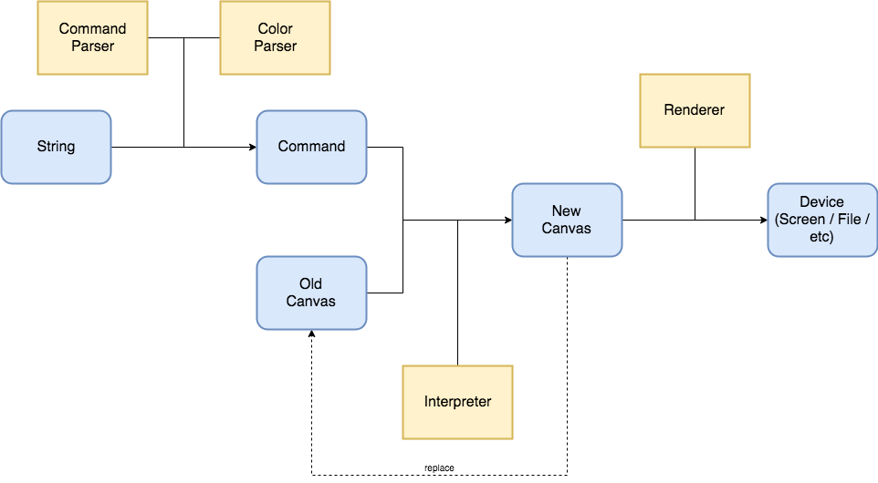
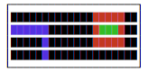
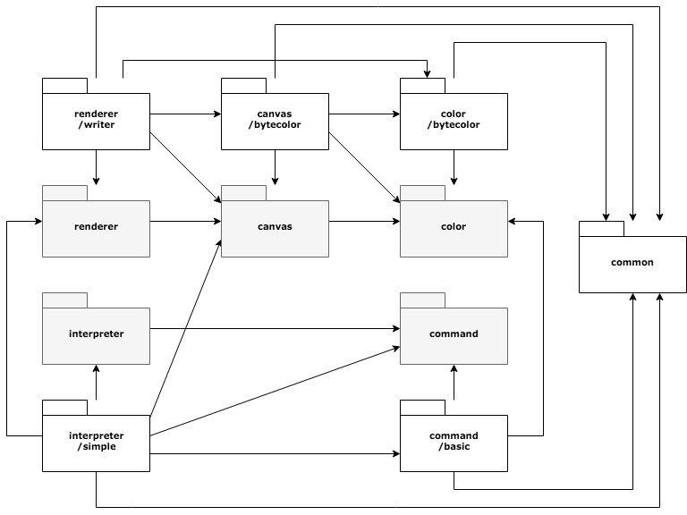
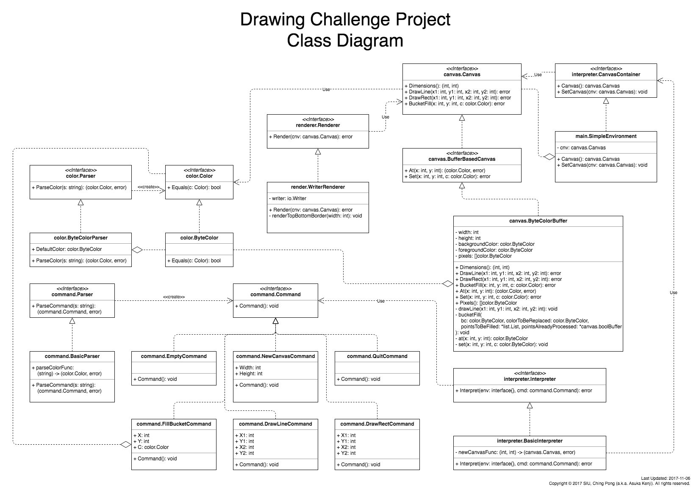

# Drawing Challenge

The latest version of this project is available at:

https://github.com/asukakenji/drawing-challenge

## Manuals

- [User Manual](#user-manual)
- [Technical Diagrams](#technical-diagrams)
- [Design Documentation](#design-documentation)
- [API Documentation](#api-documentation)

## User Manual

### Installation (From GitHub, Preferred Way)

1. Download Go from the official web site [here](https://golang.org/dl/).
1. Follow the installation instructions [here](https://golang.org/doc/install) to complete the installation.
   - The most important point is setting the `PATH` and `GOPATH` environment variables correctly.
1. Start a command prompt / terminal
1. Enter the following command to download the source from GitHub:

        go get -u github.com/asukakenji/drawing-challenge
1. Enter the following commands to execute the program:

    UNIX-based operating systems:

        $GOPATH/bin/drawing-challenge

    Windows:

        %GOPATH%\bin\drawing-challenge.exe

### Installation (From Archive)

1. Download Go from the official web site [here](https://golang.org/dl/).
1. Follow the installation instructions [here](https://golang.org/doc/install) to complete the installation.
   - The most important point is setting the `PATH` and `GOPATH` environment variables correctly.
1. Download the source archive.
1. Decompress the source archive to the correct directory:

    UNIX-based operating systems:

        $GOPATH/src/github.com/asukakenji/drawing-challenge

    Windows:

        %GOPATH%\src\github.com\asukakenji\drawing-challenge
1. Start a command prompt / terminal
1. Enter the following commands to execute the program without compiling:

    UNIX-based operating systems:

        cd $GOPATH/src/github.com/asukakenji/drawing-challenge
        go run ./main.go

    Windows:

        cd %GOPATH%\src\github.com\asukakenji\drawing-challenge
        go run .\main.go
1. Or, enter the following commands to compile an executable from the source:

    For the current platform:

        go build github.com/asukakenji/drawing-challenge

    Cross compile for other platforms (execute one of the following commands):

        GOOS=windows GOARCH=386 go build github.com/asukakenji/drawing-challenge
        GOOS=windows GOARCH=amd64 go build github.com/asukakenji/drawing-challenge
        GOOS=darwin GOARCH=amd64 go build github.com/asukakenji/drawing-challenge
        GOOS=linux GOARCH=386 go build github.com/asukakenji/drawing-challenge
        GOOS=linux GOARCH=amd64 go build github.com/asukakenji/drawing-challenge

## Technical Diagrams

### Architecture Diagram

Click [here](https://drive.google.com/file/d/0B6JV6ICUUqcuYWpTQ1VaUnN2VEE/view?usp=sharing) for the full-size diagram.

In fact, the requirements are so simple that the entire program could be fitted
into a single `main()` function. However, this project aims to demostrate
how larger projects could be architected.

Instead of sending the result of a command directly to the screen, the input
string (like `"C 20 4"`) is parsed to a `Command` value (or "object", in OOP
terminology) by the "Command Parser" and the "Color Parser", in order to enable
it to be manipulated programmatically easily.

Then, the "Interpreter" applies the command to the existing canvas (color
buffer) to result in a new canvas. It replaces the old canvas by the new one.
In the current implementation, no new canvas is created. Only the state of the
canvas changes. However, in a functional programming setting, immutable data
structures (persistent collections) could be used and a new, light-weight canvas
could be created from the old one.

Finally, the new canvas is rendered on the screen (or other devices) by the
"Renderer".

Note that any of the above entities - "Command Parser", "Color Parser",
"Interpreter", and "Renderer", and even "Command", and "Canvas" - are loosely
coupled. They are only related by their interfaces - not by their
implementations. In short, they could be developed by different developers,
and could be evolved independently.

For instance, a canvas like this:

    ----------------------
    |             RRRRR  |
    |BBBBBB       RGGGR  |
    |     B       RRRRR  |
    |     B              |
    ----------------------

could be rendered as shown above, or, with an appropriate "Renderer",
as a sequence of full block characters (`U+2588` = `█`) of different colors
(`R` = red, `G` = green, `B` = blue) on a color terminal (using escape codes,
for example), as shown below:

(Click [here](./images/color_terminal_render.sh) to see the source code of the above picture)

Like-wise, the "Command Parser" could support more commands, for example,
`"S screen1.png"` to save the canvas to a file named `"screen1.png"`. If the
"Interpreter" does not understand this command, it would handle it gracefully.
Otherwise, it could pick an appropriate "Renderer" to handle the request.

Many other possibilities exist: non-buffer-based canvas, client-server model
using WebSockets, 32-bit RGBA colors, and more. The architecture implemented in
this project is flexible enough to handle them all.

### Package Diagram

There are 5 library packages for interfaces, 6 library pachages for non-interfaces,
and 1 main package. The library package are shown in the following diagram:

Click [here](https://drive.google.com/file/d/1WtJBLJyGjeKflJlvTQpVqqReJshxw5i4/view?usp=sharing) for the full-size diagram.

#### Interface Packages

Package `color` defines the `Color` interface and the `Parser` interface.

Package `canvas` defines the `Canvas` interface and the `BufferBasedCanvas` interface.

Package `renderer` defines the `Renderer` interface.

Package `command` defines the `Command` interface, and the `Parser` interface.

Package `interpreter` defines the `Interpreter` interface.

#### Non-Interface Packages

Package `common` defines types and variables
which are needed by other packages in the project.

Package `bytecolor` (`color/bytecolor`) defines the `ByteColor` type,
which implements the `color.Color` interface,
and the `Parser` type,
which implements the `color.Parser` interface.

Package `bytecolor` (`canvas/bytecolor`) defines the `Buffer` type,
which implements the `canvas.BufferBasedCanvas` interface.

Package `basic` defines several "Value Object" types
which implement the `command.Command` interface,
and the `Parser` type,
which implements the `command.Parser` interface.

Package `writer` defines the `Renderer` type,
which implements the `renderer.Renderer` interface.

Package `simple` defines the `Interpreter` type,
which is a stateless interpreter implementing `interpreter.Interpreter`,
and the `CanvasContainer` interface and the `Quitter` interface,
which are used to specify the requirements of the `Interpreter` type,
and the `Environment` type, which fulfills the requirements.

### Class Diagram

Click [here](https://drive.google.com/file/d/0B6JV6ICUUqcubG5reGRSaEdmMEE/view?usp=sharing) for the full-size diagram.

## Design Documentation

### Empty Command Behavior

If the user presses enter without entering any command, the prompt will be
printed again.

This behavior is influenced by most existing REPL (Read-Eval-Print Loop).

### EOF Behavior

If the user sends a EOF character (`Ctrl-D` on UNIX, or `Ctrl-Z` on Windows),
the program quits as if it receives a quit command.

This behavior is influenced by most existing REPL (Read-Eval-Print Loop).

### New Canvas Behavior

The new canvas function creates a new canvas. If a canvas already exists, it
will be destroyed and replaced by the new one.

Another option is to tell the user that a canvas is already created, and refuse
to create a new one. However, this seems not robost enough since the user needs
to quit and execute the program again to create another canvas.

### Bucket Fill Behavior

The bucket fill function fills the area enclosing (x, y). The pixels connecting
to (x, y) having the same color as that at (x, y) are replaced by c.

This behavior is influenced by most existing drawing software.

## API Documentation (From GoDoc, Preferred Way)

Visit the following URL:

https://godoc.org/github.com/asukakenji/drawing-challenge

## API Documentation (From Localhost)

Run the following command in the command prompt / terminal:

    godoc -http :6060

Then, open a web browser and visit:

http://127.0.0.1:6060/pkg/github.com/asukakenji/drawing-challenge/
