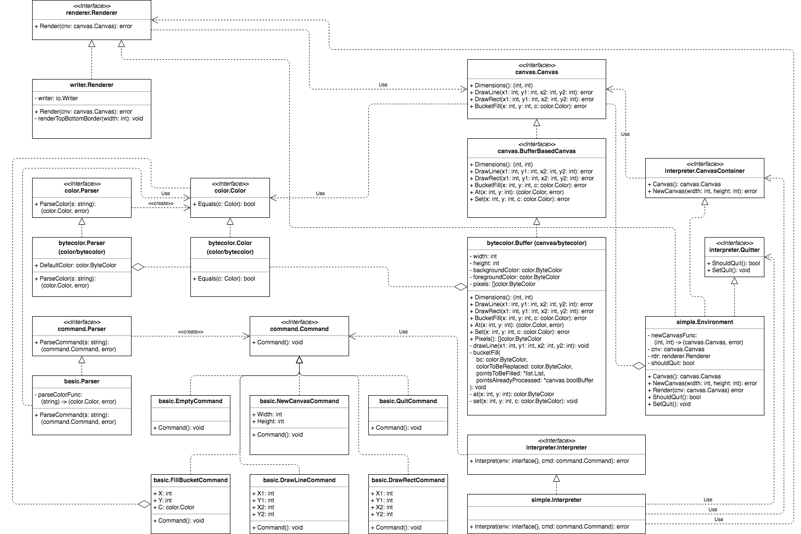

# Drawing Challenge

The latest version of this project is available at:

https://github.com/asukakenji/drawing-challenge

## Manuals

- [User Manual](#user-manual)
- [Technical Diagrams](#technical-diagrams)
- [Design Documentation](#design-documentation)
- [API Documentation](#api-documentation)

## User Manual

### Installation (From GitHub, Preferred Way)

1. Download Go from the official web site [here](https://golang.org/dl/).
1. Follow the installation instructions [here](https://golang.org/doc/install) to complete the installation.
   - The most important point is setting the `PATH` and `GOPATH` environment variables correctly.
1. Start a command prompt / terminal
1. Enter the following command to download the source from GitHub:

        go get -u github.com/asukakenji/drawing-challenge
1. Enter the following commands to execute the program:

    UNIX-based operating systems:

        $GOPATH/bin/drawing-challenge

    Windows:

        %GOPATH%\bin\drawing-challenge.exe

### Installation (From Archive)

1. Download Go from the official web site [here](https://golang.org/dl/).
1. Follow the installation instructions [here](https://golang.org/doc/install) to complete the installation.
   - The most important point is setting the `PATH` and `GOPATH` environment variables correctly.
1. Download the source archive.
1. Decompress the source archive to the correct directory:

    UNIX-based operating systems:

        $GOPATH/src/github.com/asukakenji/drawing-challenge

    Windows:

        %GOPATH%\src\github.com\asukakenji\drawing-challenge
1. Start a command prompt / terminal
1. Enter the following commands to execute the program without compiling:

    UNIX-based operating systems:

        cd $GOPATH/src/github.com/asukakenji/drawing-challenge
        go run ./main.go

    Windows:

        cd %GOPATH%\src\github.com\asukakenji\drawing-challenge
        go run .\main.go
1. Or, enter the following commands to compile an executable from the source:

    For the current platform:

        go build github.com/asukakenji/drawing-challenge

    Cross compile for other platforms (execute one of the following commands):

        GOOS=windows GOARCH=386 go build github.com/asukakenji/drawing-challenge
        GOOS=windows GOARCH=amd64 go build github.com/asukakenji/drawing-challenge
        GOOS=darwin GOARCH=amd64 go build github.com/asukakenji/drawing-challenge
        GOOS=linux GOARCH=386 go build github.com/asukakenji/drawing-challenge
        GOOS=linux GOARCH=amd64 go build github.com/asukakenji/drawing-challenge

## Technical Diagrams

### Architecture Diagram

Click [here](https://drive.google.com/file/d/0B6JV6ICUUqcuYWpTQ1VaUnN2VEE/view?usp=sharing) for the full-size diagram.

This project is very simple. In fact, it could be written using only the
`main()` function. However, it is a good chance to demostrate how a bigger
project could be designed.

Instead of translating a command like `"C 20 4"` directly to the screen, it is
parsed to a `Command` value, by the "Command Parser" and the "Color Parser", so
that it could be manipulated programmatically.

Then, the "Interpreter" applies the command on the existing canvas (color
buffer) to result in a new canvas. It replaces the old canvas by the new one.
Technically speaking, no new canvas is created. Only the state of the canvas
changes.

Finally, the new canvas is rendered on the screen (or any device) by the
"Renderer".

Note that any of the above entities: "Command Parser", "Color Parser",
"Interpreter", and "Renderer", and even "Command", and "Canvas" could be
developed by different developers, and could be updated independently.

For instance, a canvas like this:

    ----------------------
    |             RRRRR  |
    |BBBBBB       RGGGR  |
    |     B       RRRRR  |
    |     B              |
    ----------------------

could be rendered as shown above, or, with an appropriate "Renderer",
as a sequence of `█` characters of different colors (`R` = red, `G` = green,
`B` = blue).

Like-wise, the "Command Parser" could support more commands, for example,
`"S screen1.png"` to save the canvas to a file named "screen1.png". If the
"Interpreter" does not understand this, it will handle it gracefully. Otherwise,
it picks an appropriate "Renderer" to handle the request.

Many other possibilities exist: non-buffer-based canvas, client-server model
using WebSockets, 32-bit RGBA colors, and more. This architecture is flexible
enough to handle them all.

### Package Diagram

There are 6 library packages and 1 main package, as shown in the diagram:

Click [here](https://drive.google.com/file/d/0B6JV6ICUUqcuazU1RDV0MUNrMmM/view?usp=sharing) for the full-size diagram.

Package common defines types and variables
which are needed by other packages in the project.

Package color defines the Color interface,
the ByteColor type which implements it, the Parser interface,
and the ByteColorParser type which implements it.

Package canvas defines the Canvas interface,
the BufferBasedCanvas interface,
and the ByteColorBuffer type which implements it.

Package command defines the Command interface,
several types which implement it, the Parser interface,
and the BasicParser type which implements it.

Package renderer defines the Renderer interface,
and the WriterRenderer type which implements it.

Package interpreter defines the Interpreter interface,
and the BasicInterpreter type which implements it.

### Class Diagram

Click [here](https://drive.google.com/file/d/0B6JV6ICUUqcubG5reGRSaEdmMEE/view?usp=sharing) for the full-size diagram.

## Design Documentation

### Empty Command Behavior

If the user presses enter without entering any command, the prompt will be
printed again.

This behavior is influenced by most existing REPL (Read-Eval-Print Loop).

### EOF Behavior

If the user sends a EOF character (`Ctrl-D` on UNIX, or `Ctrl-Z` on Windows),
the program quits as if it receives a quit command.

This behavior is influenced by most existing REPL (Read-Eval-Print Loop).

### New Canvas Behavior

The new canvas function creates a new canvas. If a canvas already exists, it
will be destroyed and replaced by the new one.

Another option is to tell the user that a canvas is already created, and refuse
to create a new one. However, this seems not robost enough since the user needs
to quit and execute the program again to create another canvas.

### Bucket Fill Behavior

The bucket fill function fills the area enclosing (x, y). The pixels connecting
to (x, y) having the same color as that at (x, y) are replaced by c.

This behavior is influenced by most existing drawing software.

## API Documentation

// TODO: Write this!
